# Hyeonah Cho - Portfolio Task

​
[My portfolio site](https://hyeonahyeah.github.io/)
​

## Project Requirements

### Content

This portfolio site showcases my personal and professional background in a clean and modern single-page design.  
 I chose a **minimal, scroll-snap layout** to create a smooth navigation flow between sections.  
 The aesthetic focuses on **contrast and readability**.
To match my interest, I added a little automated chat flow.

- [x] A profile picture with styled avatar effects
- [x] A biography (well over 100 words) introducing my professional background, mindset, and personal interests
- [x] A functional **Contact button** leading to the Connect section
- [x] A "Projects" section with GitHub links (More links to be added)
- [x] External links to my GitHub, LinkedIn, Spotify and email (with auto-filled)
      ​

### Technical

For the technical implementation, I focused on **accessibility, responsiveness, and modern web standards**.  
 I structured the site as a **multi-section single-page app** with scroll-snap for a smooth user experience.  
 Version control was done with Git, and the site was deployed using GitHub Pages.
Design is fully responsive, adapting from mobile to desktop with **media queries** and **flex/grid layouts**.  
 Semantic HTML elements (e.g., `<section>`, `<nav>`, `<h1>–<h3>`) were used for better accessibility.

- [x] At least 2 "pages" (in this case, sections: Home, Bio, Projects, Connect)
- [x] Version controlled with Git
- [x] Deployed on GitHub pages
- [x] Responsive design with CSS grid/flex + media queries
- [x] Semantic HTML structure

### Bonus

I also included several **enhancements beyond the requirements**:

- [x] Hover, active, and focus styles for buttons and social icons
- [x] JavaScript for dynamic elements:
  - Typing animation in the Hero (Home) section
  - Interactive "About Me" slider with swipe gestures
  - Automated chat-style interaction for the Hero assistant
    ​

### Future Improvements (Out of Scope but Planned)

During development I had additional ideas and features I wanted to implement, but they were outside the project scope or I ran out of time. I’m including them here as potential next steps.

- **Automation Chat Box**

  - [ ] Fix the spacing issue where the last bubble has too much empty vertical space
  - [ ] Response bubbles should start in grey instead of changing from black to grey after the user answers
  - [ ] Add the ability to collapse/expand bubbles
  - [ ] Preserve collapsed state when navigating away and returning (bug currently on smaller devices such as iPhone X/SE)
  - [ ] Remove the diamond pointer from the “Let's explore~” starter bubble

- **Bio Section**

  - [ ] Add gradient to the purple shadow around the profile picture
  - [ ] Make card transitions more dynamic (track structure currently breaks the layout)
  - [ ] Animate card subtitles with a neon glow effect
  - [ ] Brainstorm ways to present the Tech Stack section more advanced and engaging

- **Chores**
  - [ ] Fix “About” blur issue on certain devices (e.g., iPhone 12 Pro) where the first page shows blurred when it should not
  - [ ] Refactor and clean up layout for better consistency
  - [ ] Implement auto/manual light–dark mode toggle

### Screenshots

#### Desktop

- Hero (Home) Section  
  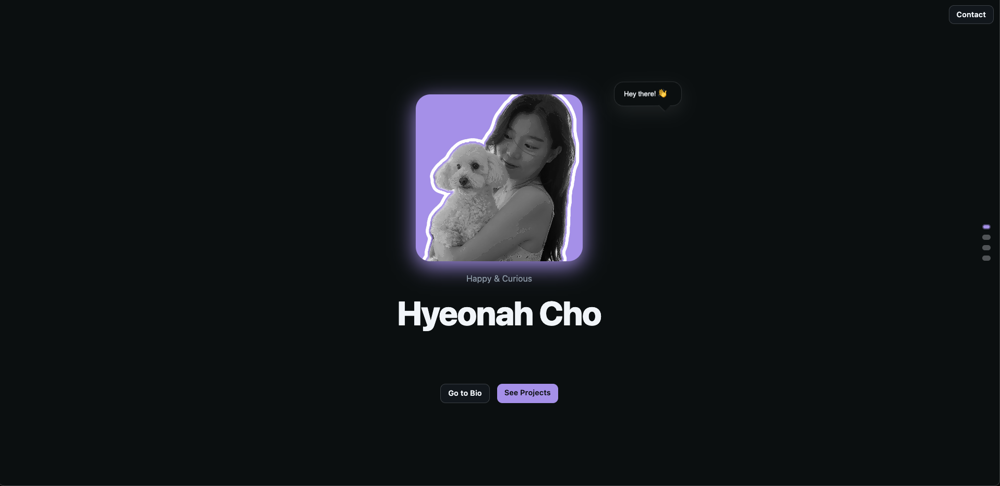
- Bio Section  
  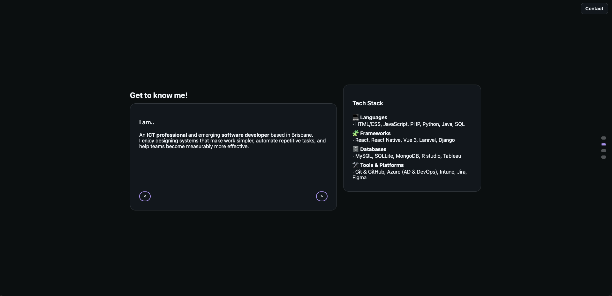
- Projects Section  
  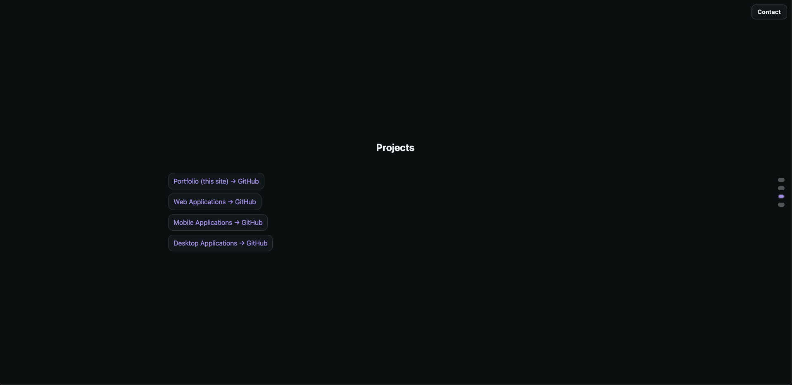
- Connect Section  
  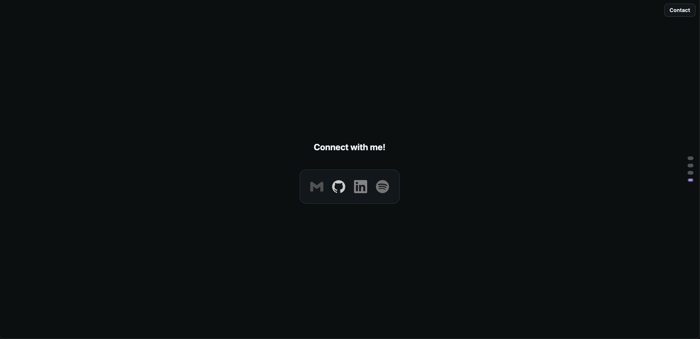

#### Tablet

- Hero (Home) Section  
  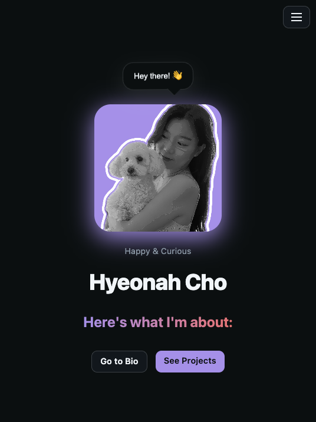
- Bio Section  
  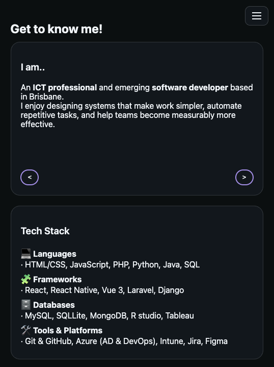
- Projects Section  
  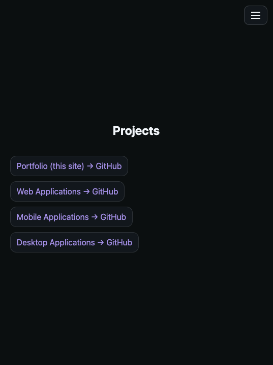
- Connect Section  
  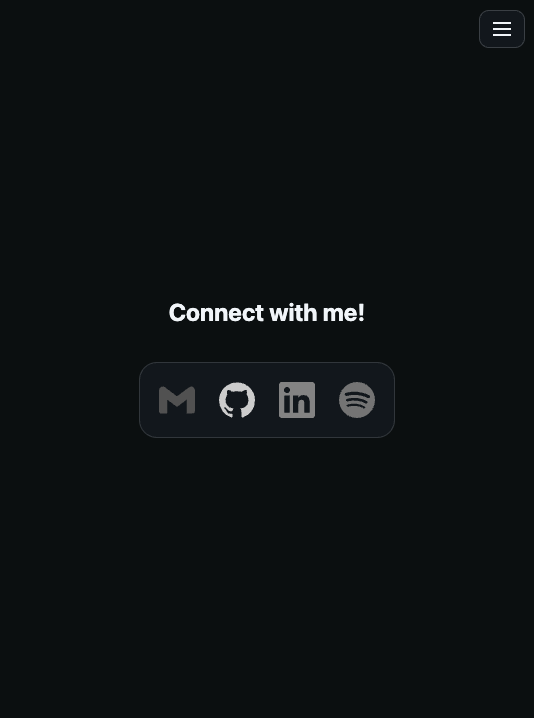

#### Mobile

- Hero (Home) Section  
  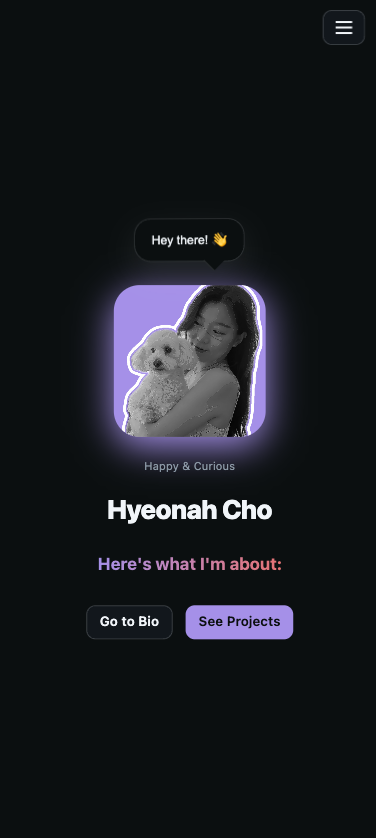
- Bio Section  
  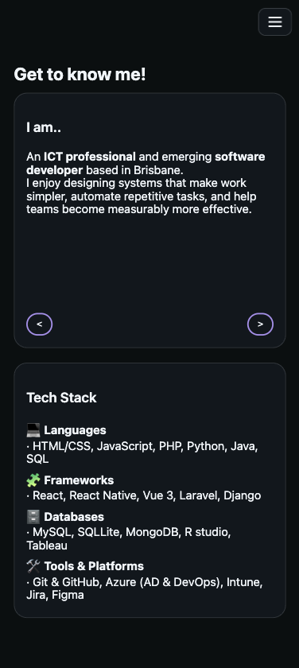
- Projects Section  
  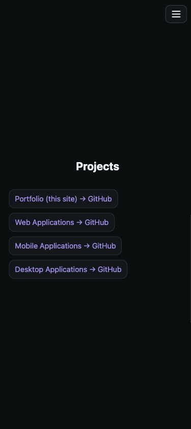
- Connect Section  
  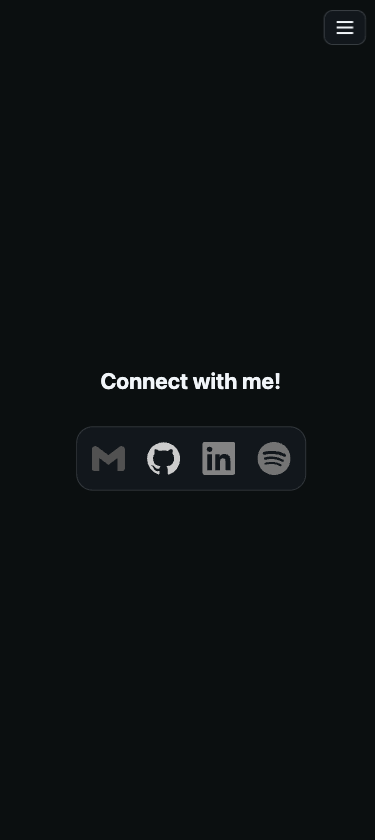

#### States & Features (Video)

- Hover, Active & Features

- Focus State
